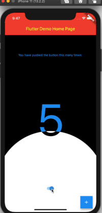

# animated_theme_switcher

[](https://pub.dartlang.org/packages/animated_theme_switcher)


Animated theme switcher.

This library starts from [Peyman's](https://stackoverflow.com/users/4910935/peyman) stackoverflow question [how-to-add-animation-for-theme-switching-in-flutter](https://stackoverflow.com/questions/60897816/how-to-add-animation-for-theme-switching-in-flutter)



## Getting started

Add animated_theme_switcher: "^2.0.5" in your pubspec.yaml dependencies.

```yaml
dependencies:
 animated_theme_switcher: "^2.0.5"
```

### How To Use

Import the following package in your dart file

```dart
import 'package:animated_theme_switcher/animated_theme_switcher.dart';
```

Wrap MaterialApp with ThemeProvider widget, as it has shown in the following example:

```dart
  ThemeProvider(
      initTheme: initTheme,
      builder: (context, myTheme) {
        return MaterialApp(
          title: 'Flutter Demo',
          theme: myTheme,
          home: MyHomePage(),
        );
      }),
    ),
```

But if all you want is to _provide_ a theme, use as follows:

```dart
  ThemeProvider(
      initTheme: initTheme,
      child: SomeCoolPage(),
    ),
```

Wrap the screen where you whant to make them switch with ThemeSwitchingArea widget, as it has shown in the following example: 

```dart
    ThemeSwitchingArea(
      child: Builder(builder: (context) {
        return ...,
      },
    );
```


Wrap every switcher with ThemeSwitcher builder, and use ThemeSwitcher.of(context).changeTheme function to switch themes;

```dart

    ThemeData newTheme = ThemeData(
      primaryColor: Colors.amber
    );
    ...
    ThemeSwitcher(
      builder: (context) {
        ...
        onTap: () => ThemeSwitcher.of(context).changeTheme(
          theme: newTheme,
          isReversed: false // default: false 
        );
        ...
      },
    );
```

Alternatively you could use ThemeSwitcher.switcher() or ThemeSwitcher.withTheme().  
Builders of this constructors already provide you ThemeSwitcher.  
ThemeSwitcher.withTheme() also provides current theme:

```dart
    ThemeSwitcher.switcher(
      builder: (context, switcher) {
        ...
        onTap: () => switcher.changeTheme(
          theme: newTheme,
        );
        ...
      },
    );
    
    ThemeSwitcher.withTheme(
      builder: (context, switcher, theme) {
        ...
        onTap: () => switcher.changeTheme(
          theme: theme.brightness == Brightness.light
              ? darkTheme
              : lightTheme,
        );
        ...
      },
    );
```

Use optional named parameter clipper to pass the custom clippers.

```dart
    ...
    ThemeSwitcher(
      clipper: ThemeSwitcherBoxClipper(),
      builder: (context) {
        ...
      },
    );
```

**Notes:**

1. This package is not intended to persist selected theme on the local device. But we added [special example](https://github.com/kherel/animated_theme_switcher/blob/master/example/lib/with_saving_theme.dart) to show how to do it using [shared_preferences](https://pub.dev/packages/shared_preferences) package.

2. Use the CanvasKit rendering engine to use it on **web**, [more about it..](https://github.com/kherel/animated_theme_switcher/issues/23)
