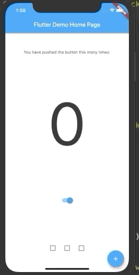

# animated_theme_switcher

[](https://pub.dartlang.org/packages/animated_theme_switcher)


Animated theme switcher.

This library starts from [Peyman's](https://stackoverflow.com/users/4910935/peyman) stackoverflow question [how-to-add-animation-for-theme-switching-in-flutter](https://stackoverflow.com/questions/60897816/how-to-add-animation-for-theme-switching-in-flutter)



## Getting started

Add animated_theme_switcher: "^1.0.2" in your pubspec.yaml dependencies.

```yaml
dependencies:
 animated_theme_switcher: "^1.0.2"
```

### How To Use

Import the following package in your dart file

```dart
import 'package:animated_theme_switcher/animated_theme_switcher.dart';
```

Wrap MaterialApp with ThemeProvider widget, as it has shown in the following example:

```dart
  ThemeProvider(
      initTheme: initTheme,
      child: Builder(builder: (context) {
        return MaterialApp(
          title: 'Flutter Demo',
          theme: ThemeProvider.of(context),
          home: MyHomePage(),
        );
      }),
    ),
```

Wrap the screen where you whant to make them switch with ThemeSwitchingArea widget, as it has shown in the following example: 

```dart
    ThemeSwitchingArea(
      child: Builder(builder: (context) {
        return ...,
      },
    );
```


Wrap every switcher with ThemeSwitcher builder, and use ThemeSwitcher.of(context).changeTheme function to switch themes;

```dart

    ThemeData newTheme = ThemeData(
      primaryColor: Colors.amber
    );
    ...
    ThemeSwitcher(
      builder: (context) {
        ...
        onTap: () => ThemeSwitcher.of(context).changeTheme(theme: newTheme);
        ...
      },
    );
```

